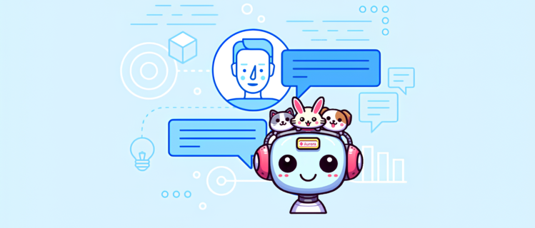

<h1 align="center">Development of AWS Solutions for Text-to-Speech Conversion and Chatbot Creation</h1>

<h2 align="center"><i>Meet AUrora - A Chatbot for the AUmigo Veterinary Clinic</i></h2>

<div align="center"></div>

## 🎯 Objective
<p> To develop an endpoint for text-to-speech conversion and create a chatbot that must have the option to send the response in audio format, using the chatbot's text response with the API. </p>

## 📖 Description
<p> The developed chatbot is named Aurora and was programmed for the AUmigo veterinary clinic. </p>
This project consisted of two main parts:

1.  **Endpoint for Text-to-Speech Conversion (/v1/tts)**

    - Receives a sentence in JSON format and converts the text into audio using AWS Polly.
    - Stores the generated audio in a public AWS S3 bucket.
    - Saves references of the sentence and the audio in DynamoDB, using a unique hash code.
    - Returns the audio URL and other relevant information if the sentence has been previously processed.

2.  **AUrora Chatbot with Amazon Lex V2**

    - Development of a chatbot for the AUmigo veterinary clinic, which was integrated with Slack.
    - The chatbot has seven distinct intents and captures information through slots.
      - Intents: `EndConversation` `Menu` `CancelAppointment` `Location` `Greetings` `FindAppointment` `ScheduleAppointment`
      - Slots: `ConfirmationResponse` `MenuOptions` `Species`
    - It uses response cards for interactivity and has fallback handling for errors.
    - It can send responses in audio format using the /v1/tts endpoint.

## 🚀 How to Use the Code

1.  Prerequisites:
    - Python installed
    - AWS Account
    - Slack Account

2.  Clone the repository:
    ```bash
    git clone -b https://github.com/Layonj3000/AUrora_bot_aws.git
    cd AUrora_bot_aws
    ```

3.  To run:
    - Configure the AWS CLI with your credentials
    - Add a .env file according to the .env.example

4.  Actions in AWS
    - Create a table in DynamoDB with the primary key `unique_id`
    - Create a bucket in S3 and configure its permissions to be public
    - Create a Lambda function and add the code
    - Import the bot into Amazon Lex

5.  Actions on the Slack Platform
    - Create a Slack messaging app
    - Integrate the Slack app with the Amazon Lex bot
    - Test the integration by starting a conversation with your Amazon Lex bot. You send messages with the Slack app and test in a browser window.

## 📂 Project Structure
```
project-root/
├── 📁 assets
│       └── architecture.jpg                   # Project architecture
│
├── 📁 src
│   ├── 📁 api-tts
│   │       ├── dynamodb_operations.py         # Create, read, update, and delete items in the DynamoDB table
│   │       ├── handler.py                     # Entry point for the Lambda function
│   │       ├── polly_operations.py            # Functions to interact with Amazon Polly, which converts text to speech
│   │       ├── s3_operations.py               # Functions to interact with Amazon S3
│   │       ├── serverless.yml                 # Configuration file for the Serverless framework
│   │       └── utils.py                       # Utility and helper functions used in various parts of the code, such as data formatting or common validations
│   │
│   └── 📁 chatbot
│       ├── 📁 bot lex
│       │       └── Aurora-DRAFT.zip          # Aurora Chatbot
│       ├── 📁 scripts
│       │   ├── 📁 lambda-function
│       │   │       └── lambda_function.py    # Lambda function code
│       │   └── setup_aurora_bd.py            # Python script to set up the Aurora database, including table creation
│       └── .env.example                      # Example .env configuration file, providing a template for defining necessary environment variables for the project
└── README.md                                 # Project documentation


```


## 💻 Technologies Used
<p align="center">
    <code>AWS Polly</code> <code>AWS S3</code> <code>AWS DynamoDB</code> <code>Amazon Lex V2</code> <code>Slack</code> <code>MySQL</code> <code>Python (Boto3)</code> <code>Kanban</code> <code>Discord</code>
</p>

## 🏗️ Project Architecture

<p align="center">
  
</p>

## 🛠️ Challenges

1.  <p align="justify"> We faced significant difficulties when trying to use the chatbot with a web connection. After several unsuccessful attempts and adjustments, we decided to migrate the integration to Slack.
</p>

2.  <p align="justify"> Integrating the voice API into Lambda presented several technical challenges. We had to ensure that all dependencies were correctly configured and that the environment was prepared to handle voice requests, which required a series of tests and adjustments.
</p>

## 👥 Authors

<div>
  <table style="margin: 0 auto;">
    <tr>
      <td><a href="https://github.com/gabrielvavelar"><br><sub>Gabriel Avelar</sub></a></td>
      <td><a href="https://github.com/Layonj300"><br><sub>Layon Reis</sub></a></td>
      <td><a href="https://github.com/LuizFillipe1"><br><sub>Luiz Fillipe</sub></a></td>
      <td><a href="https://github.com/PamelaPavan"><br><sub>Pamela Pavan</sub></a></td>
    </tr>
  </table>
</div>
